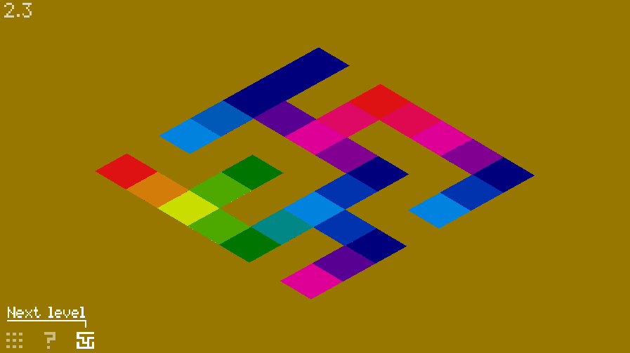
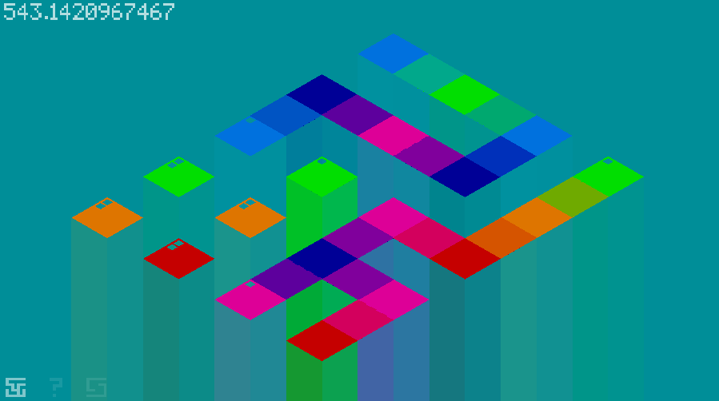

# Lico

A colorful game about linking all the nodes of colors of the level.

This is an extended version of Linked Colours, the game I made for the Ludum Dare 30
https://github.com/florentpoujol/craftstudio-stuffs/tree/master/linked-colours

The build from le 12 february 2015 is playable but some stuffs are still broken.

There is 7 man-made levels and a random level generator.

